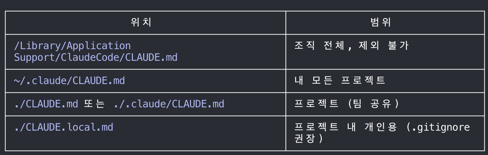

# features-overview

문서: [https://code.claude.com/docs/ko/features-overview.md](https://code.claude.com/docs/ko/features-overview.md)  |  상태: 📖 |  확인: v2.1.193 2026-08-21

## 한 줄 요약

Claude.md는 기본적으로 자동으로 읽히지만, 강제 설정이 아니라 컨텍스트를 제공하는 역할을 하는 것이기 때문에 엄격하게 강제되어야 하는 경우엔 Hook을 사용해야 한다.

규칙을 파일 타입별로 분리하려면

```
.claude/rules/ + paths
```

를 쓰면 된다.

## 읽기 전 내 예상

<!-- 반드시 읽기 전에 먼저 적을 것 -->

## 문서 정리

모든 대화 세션에서 로드되는 컨텍스트. 요청을 실행하기 전에 가장 먼저 읽고 그에 맞게 행동한다 : [Claude.md](http://Claude.md)

내가 특정 행동을 자동화하고 싶어 : Skill

메인 컨택스트를 아끼기 위해 많은 파일을 읽지만 메인 세션에는 주요 결과만 반환하는 연구 작업 : Subagent

이런 Subagent들이 팀을 꾸린다 : Agent teams

매번 요청하지 않고도 무언가가 발동되기를 원함 : hook

## 몰랐던 것 / 착각했던 것

[Claude.md](http://Claude.md) 로드 방식에 있어 매 실행 일관성이 유지되지 않았던 부분이 있었는데 이번에 

[https://code.claude.com/docs/ko/memory#how-claude-md-files-load.md](https://code.claude.com/docs/ko/memory#how-claude-md-files-load.md)

를 읽고 조금은 정리된 것 같아. 내용을 붙인다.


Claude.md는 매 질문마다 자동 로드된다.

단, 시스템 프롬프트가 아니라 사요앚 메시지로 전달된다. 그러니까 즉 Claude에게 "참고해라" 이런 맥락으로 주어진다는 거지. 무조건 따라야 하는 명령이 아니라는 거다. 그러니까 지침이 모호하거나 충돌하면 Claude가 임의로 [Claude.md](http://Claude.md) 에 없는 방식을 선택할 수도 있는 거지. 우리는 그럼 그걸 보고 "얘 또 이상해졌네"가 되는 거고.

그래서 이걸 강제하고 싶으면 Hook을 사용해서 강제성을 부여해야 한다는 거임.


### Claude.md는 여러개일 수 있다.



하위 디렉토리 CLAUDE.md는 해당 디렉토리 파일을 실제로 읽을 떄 지연 로드된다.

### Rules도 활용해보자.

[CLAUDE.md](http://CLAUDE.md)대신 여기에 규칙 파일을 분리해서 넣을 수 있음.

핵심 장점은 자주 안 쓰는 규칙을 매번 컨텍스트에 올리지 않아도 된다는 거임. "필요한 정보만 컨텍스트에 알뜰히!!"

```
CLAUDE.md              │ 매 세션 항상 필요한 규칙 (200줄 이하 유지)
.claude/rules/ + paths │ 특정 파일 타입·디렉토리에만 적용되는 규칙
Hook                   │ Claude 판단과 무관하게 강제 실행이 필요한 것
Skill                  │ 매 세션 필요하지 않고 특정 상황에만 호출하는 절차
```

## 이걸 쓰면 저걸 쓸 필요가 없다

<!-- 예: Claude Code hooks로 pre-commit 검사를 하면 별도 린트 CI 스텝이 필요 없다 -->

## 실행 결과

## 남은 질문

